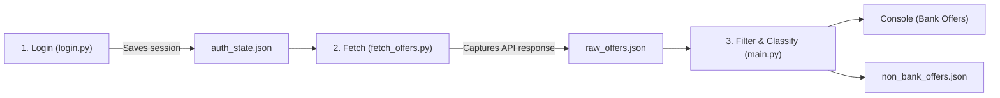

# Zepto Payment & Bank Offers Scraper

An automated pipeline to extract and classify Zepto payment offers into **Bank** and **Non-Bank** (Wallets, UPI apps, Card Networks, Fintechs) sources using Playwright.

---

## 🚀 Quickstart & Setup

### 1. Prerequisites
- Python 3.10+
- A valid Zepto account and at least one item added to your Zepto cart (offers only appear on an active cart).

### 2. Installation
Install the necessary dependencies and the Playwright Chromium browser binaries:

```bash
pip install playwright
playwright install chromium
```

---

## 🛠️ Usage

### Run the Full Pipeline
Run the main pipeline script:

```bash
python main.py
```

### CLI Options & Flags
- **`--headless`**: Runs the browser in headless mode during the fetching step.
  ```bash
  python main.py --headless
  ```
- **`--relogin`**: Forces a fresh manual login session even if `auth_state.json` already exists.
  ```bash
  python main.py --relogin
  ```

---

## 🔄 Architecture & Pipeline Flow

The workflow is orchestrated via `main.py` across three primary stages:



1. **Authentication (`login.py`)**:
   - Opens a real browser window to let the user log in via OTP and set their delivery location.
   - Saves cookies, tokens, and storage state to `auth_state.json`.
   - Reused across runs so you only need to log in once.
2. **Offer Scraping & Network Interception (`fetch_offers.py`)**:
   - Opens the Zepto cart page (`/?cart=open`) with the authenticated context.
   - Clicks *"View all payment offers"* to open the coupon drawer.
   - Intercepts the API call fired to `/cart/coupons/fetch-list` and dumps the entire JSON payload into `raw_offers.json`.
   - Also records masked headers and payload structure in `captured_request.json` for debugging.
3. **Filtering & Classification (`main.py`)**:
   - Parses every `COUPON_CARD_WIDGET` from the raw data.
   - Checks the offer heading and issuer against a list of non-bank keywords.
   - Prints all bank offers clearly to the console (including code, bank name, state, and description).
   - Silently persists all non-bank offers (Wallets, UPI, Networks) to `non_bank_offers.json`.

---

## ⚖️ Design Decisions & Trade-offs

### 1. Browser Automation (Playwright) vs Direct API Replay
- **Decision**: We use Playwright with a persistent browser session (`auth_state.json`) to trigger the natural user flow and intercept the response.
- **Why**: 
  - Direct HTTP scraping often triggers bot protection (Cloudflare, WAF, dynamic request tokens, device fingerprinting).
  - Zepto's checkout and coupon endpoints require dynamic session tokens, geolocations, and cart IDs.
  - Intercepting the real browser response avoids reverse-engineering dynamic API headers or handling short-lived authorization handshakes.

### 2. Blocklisting Non-Banks vs Allowlisting Banks
- **Decision**: We filter offers by **ignoring known non-bank card networks and fintech apps**, rather than maintaining a list of banks.
- **Why**:
  - **Scale & Volatility**: India has hundreds of scheduled commercial, cooperative, regional rural, and small finance banks (SBI, HDFC, ICICI, AU, Jana, IDFC, Federal, etc.), plus co-branded card variations. Maintaining an exhaustive bank list is error-prone and brittle.
  - **Stability of Non-Banks**: The universe of non-bank entities (card networks like *Visa*, *Mastercard*, *RuPay*, *Amex*, and payment apps/wallets like *Paytm*, *Amazon Pay*, *MobiKwik*, *Bajaj Pay*, *Jupiter*, *BHIM*, *Novio*) is small and relatively static.
  - **Forward Compatibility**: When a new bank (e.g., Kotak, Bandhan, Yes Bank) introduces a promotional offer, it is automatically recognized as a bank offer without needing any code updates.

### 3. All-Offers Capture vs Individual Pill Filtering
- **Decision**: Captured the global fetch-list response without applying any UI filter pills (e.g., Card, UPI, Wallet).
- **Why**: 
  - Bank offers on Zepto are not limited to Cards. Direct bank app/UPI integrations (such as *Kotak811 App* or *AU 0101 App*) and RuPay credit cards on UPI are present in the global offers list.
  - Fetching everything in one request is faster, less flaky, and provides full visibility over the entire offers ecosystem.

---

## 📁 Artifacts & Output Files

| File | Description | Ignored by Git |
|---|---|---|
| `auth_state.json` | Stored browser cookies and local storage tokens. | ✅ Yes |
| `raw_offers.json` | Raw unmodified API response containing all coupons. | ✅ Yes |
| `captured_request.json` | Request metadata, endpoint URL, and masked payload. | ✅ Yes |
| `non_bank_offers.json` | Filtered list of card network, wallet, and fintech offers. | ✅ Yes |

